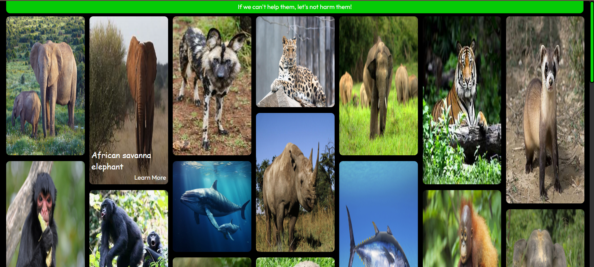
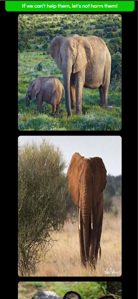

# Creating Masonry layout with CSS grid.

## overview.
Inspired by the amazing stuff people are creating on the web with the masonry layout I have also used the masonry layout to create a image gallery for endangered species on earth. I could only include a few from the many animals out there that are facing extinction.

## Learning.
I learned to create a masonry layout and in the process also got to explore the CSS `border-image` property. I also got to learn about the endnagered species, it was saddenning to see the number of animal species there are which are at the brink of extinction.

## Tech stack.
- HTML.
- CSS.
- Javascript.

## Screenshots.

## Important Resources.
- [How to Create a Masonry Layout Using HTML and CSS](https://www.freecodecamp.org/news/how-to-create-a-mansory-layout-using-html-and-css/) :Here Fanny Nyayic shows how you can implement the masonry layout using CSS `grid`.
- [What would you call this layout?](https://www.youtube.com/watch?v=azs0xtt_tJc&t=1090s&ab_channel=KevinPowell) : You can watch Kevin Powell discuss on the layout here. He basically goes through the article written by Jean Simmons on masonry layout linked below.
- [Help us invent CSS Grid Level 3, aka “Masonry” layout](https://webkit.org/blog/15269/help-us-invent-masonry-layouts-for-css-grid-level-3/) : You can read this article by Jean Simmons where she talks about the masonry layout in depth and discusses what should be the best way to implement it on the browser.
